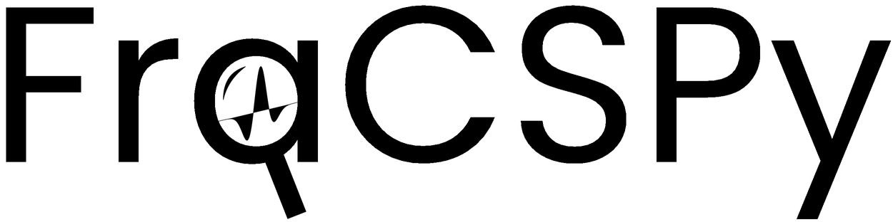

# FraCSPy

[](https://zenodo.org/badge/latestdoi/619447827)

FraCSPy stands for Python Framework for Conventional microSeismic Processing.



It is a single python toolbox for the full microseismic pipeline from modelling to post-event analysis.
This library is a single location leveraging the excellent work of other scientists (software developers) and adapts them for the specific use case of microseismic monitoring.

Some functionalities include:

- modelling script generation (for accompanying [SOFI3D](https://docs.csc.fi/apps/sofi3d/))
- event imaging: detection, location
- moment tensor inversion

Some python libraries that are utilised include:

- pylops
- torch
- obspy
- and more...

## Requirements

Installation requires either [pip](https://pypi.org/project/pip/) package installer or [Conda](https://conda.io) package manager, e.g. one can use [miniforge](https://github.com/conda-forge/miniforge).

## Install using pip

```bash
pip install fracspy
```

## Install using conda

### Linux

Simply run

```bash
make install
```

It will create a new conda environment `fracspy` with all the required packages:

Similarly, on Linux you can run:

```bash
./install.sh
```

### Windows

On Windows, the best way is to use [miniforge](https://github.com/conda-forge/miniforge) prompt and run:

```cmd
install.bat
```

It will install the package to environment `fracspy` and activate it.

To install development version use

```cmd
install-dev.bat
```

Now you are ready to use the package.

### Uninstall

If you need to add/change packages:

```bash
conda deactivate
conda remove -n fracspy -all
```

## Documentation

The latest stable documentation based on [Sphinx](https://www.sphinx-doc.org) is available online at: <https://fracspy.github.io/FraCSPy>

One can also build the documentation locally:

```bash
cd docs
make html
```

If you want to rebuild the documentation:

```bash
make clean
make html
```

After a successful build, one can serve the documentation website locally:

```bash
cd build/html
python -m http.server
```

and open in browser: <http://localhost:8000>

To build/rebuild documentation on Windows you can simply run

```cmd
build_docs.bat
```

**Note:** check the exact port number in the output
